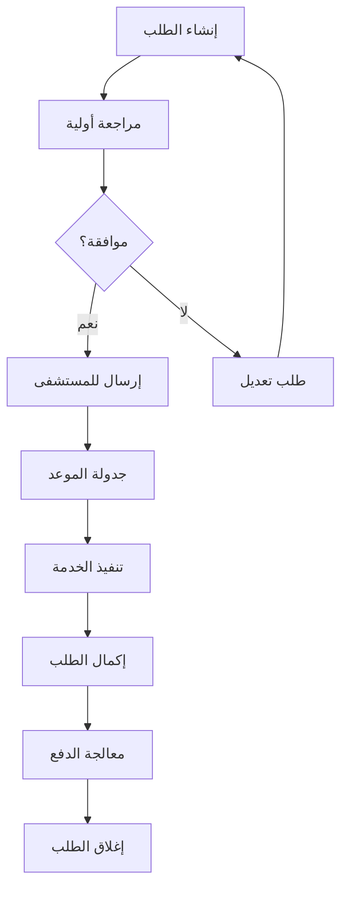

# دليل إعادة البناء الشامل - نظام إدارة الطلبات الطبية

## نظرة عامة على النظام

### الهدف الرئيسي
نظام شامل لإدارة طلبات الإحالة الطبية بين العيادات والمستشفيات مع تحليل الأداء وإعداد التقارير.

### المستخدمون المستهدفون
- **المديرون (Admin)**: إدارة كاملة للنظام
- **منسقو الحالات (Case Coordinator)**: إدارة المستشفيات
- **الأطباء (Doctor)**: إنشاء ومتابعة الطلبات
- **الممرضون (Nurse)**: مساعدة في معالجة الطلبات
- **الموظفون المستشفيات (Hospital)**: استقبال ومعالجة الإحالات
- **المالية (Finance)**: تتبع المدفوعات والإيرادات
- **خدمة العملاء (Customer Care)**: الدعم والمتابعة

---

## الصفحات الرئيسية

### 1. صفحة تسجيل الدخول (Login Page)
**المسار**: `/login`

#### التصميم والواجهة
```tsx
// التخطيط العام
<div className="min-h-screen bg-gradient-to-br from-primary/5 to-secondary/5">
  <div className="flex items-center justify-center min-h-screen p-4">
    <Card className="w-full max-w-md shadow-xl">
      <CardHeader className="text-center space-y-4">
        <Logo /> {/* شعار العيادة */}
        <h1 className="text-2xl font-bold text-primary">تسجيل الدخول</h1>
        <p className="text-muted-foreground">نظام إدارة الطلبات الطبية</p>
      </CardHeader>
      
      <CardContent>
        <form onSubmit={handleLogin}>
          <div className="space-y-4">
            <Input 
              type="email" 
              placeholder="البريد الإلكتروني"
              required
            />
            <PasswordInput 
              placeholder="كلمة المرور"
              required
            />
            <Button type="submit" className="w-full">
              تسجيل الدخول
            </Button>
          </div>
        </form>
      </CardContent>
    </Card>
  </div>
</div>
```

#### الوظائف
- تسجيل دخول بالبريد الإلكتروني وكلمة المرور
- تحقق من صحة البيانات
- إعادة توجيه حسب دور المستخدم
- رسائل خطأ واضحة
- إعادة تعيين كلمة المرور

---

### 2. لوحة تحكم الإدارة (Admin Dashboard)
**المسار**: `/admin`

#### التصميم والتخطيط
```tsx
<div className="flex min-h-screen bg-background">
  <AdminSidebar /> {/* الشريط الجانبي */}
  
  <div className="flex-1">
    <AdminHeader /> {/* رأس الصفحة */}
    
    <main className="p-6 space-y-6">
      {/* بطاقات الإحصائيات */}
      <div className="grid grid-cols-1 md:grid-cols-2 lg:grid-cols-4 gap-6">
        <MetricCard 
          title="إجمالي الطلبات"
          value="1,234"
          change="+12%"
          icon={FileText}
        />
        <MetricCard 
          title="الطلبات المكتملة"
          value="987"
          change="+8%"
          icon={CheckCircle}
        />
        <MetricCard 
          title="الطلبات المعلقة"
          value="247"
          change="-5%"
          icon={Clock}
        />
        <MetricCard 
          title="إجمالي الإيرادات"
          value="1,250,000 ريال"
          change="+15%"
          icon={DollarSign}
        />
      </div>

      {/* الرسوم البيانية */}
      <div className="grid grid-cols-1 lg:grid-cols-2 gap-6">
        <Card>
          <CardHeader>
            <CardTitle>اتجاه الطلبات الشهرية</CardTitle>
          </CardHeader>
          <CardContent>
            <LineChart data={monthlyTrends} />
          </CardContent>
        </Card>
        
        <Card>
          <CardHeader>
            <CardTitle>توزيع الحالات</CardTitle>
          </CardHeader>
          <CardContent>
            <PieChart data={statusDistribution} />
          </CardContent>
        </Card>
      </div>

      {/* تحليلات SIA */}
      <SIADashboard />
      
      {/* جدول الطلبات الحديثة */}
      <Card>
        <CardHeader>
          <CardTitle>الطلبات الحديثة</CardTitle>
        </CardHeader>
        <CardContent>
          <RequestsTable />
        </CardContent>
      </Card>
    </main>
  </div>
</div>
```

#### الميزات الرئيسية
1. **إحصائيات شاملة**: عرض مؤشرات الأداء الرئيسية
2. **تحليلات SIA**: تحليل أداء الفروع والتحويل
3. **إدارة المستخدمين**: إضافة وتعديل المستخدمين
4. **رفع الملفات**: استيراد ملفات Excel
5. **إعدادات النظام**: تخصيص الإعدادات العامة

---

### 3. لوحة تحكم منسق الحالات (Case Coordinator Dashboard)
**المسار**: `/case-coordinator`

#### التصميم المميز
```tsx
<div className="min-h-screen bg-gradient-to-br from-blue-50 to-indigo-100">
  <CaseCoordinatorSidebar />
  
  <div className="ml-64 p-6">
    <div className="bg-white rounded-lg shadow-sm p-6 mb-6">
      <h1 className="text-3xl font-bold text-gray-900 mb-2">
        مرحبًا، منسق الحالات
      </h1>
      <p className="text-gray-600">
        إدارة ومتابعة الطلبات الطبية للمستشفى
      </p>
    </div>

    {/* فلاتر متقدمة */}
    <Card className="mb-6">
      <CardContent className="p-4">
        <div className="grid grid-cols-1 md:grid-cols-4 gap-4">
          <Select placeholder="الحالة">
            <SelectItem value="pending">معلق</SelectItem>
            <SelectItem value="completed">مكتمل</SelectItem>
            <SelectItem value="cancelled">ملغي</SelectItem>
          </Select>
          
          <DateRangePicker />
          
          <Select placeholder="التخصص">
            <SelectItem value="cardiology">القلب</SelectItem>
            <SelectItem value="orthopedic">العظام</SelectItem>
          </Select>
          
          <Select placeholder="المستشفى">
            <SelectItem value="dsfh">مستشفى فقيه</SelectItem>
            <SelectItem value="salamah">السلامة</SelectItem>
          </Select>
        </div>
      </CardContent>
    </Card>

    {/* شجرة الخسائر */}
    <LossTreeAnalysis />
    
    {/* جدول الطلبات */}
    <CaseCoordinatorRequestsTable />
  </div>
</div>
```

#### الوظائف المتخصصة
- **شجرة تحليل الخسائر**: تحليل أسباب إلغاء الطلبات
- **إحصائيات المستشفى**: أداء كل مستشفى
- **إدارة الطلبات**: تعديل وتتبع الطلبات
- **تقارير مفصلة**: تقارير أداء شاملة

---

### 4. لوحة تحكم الطبيب (Doctor Dashboard)
**المسار**: `/doctor`

#### تصميم مركز على المريض
```tsx
<div className="min-h-screen bg-medical-gradient">
  <DoctorSidebar />
  
  <main className="ml-64 p-6">
    {/* رأس الصفحة */}
    <div className="bg-white rounded-xl shadow-sm p-6 mb-6 border-r-4 border-primary">
      <div className="flex items-center justify-between">
        <div>
          <h1 className="text-2xl font-bold text-gray-900">
            مرحبًا، د. {doctorName}
          </h1>
          <p className="text-gray-600">تخصص: {specialty}</p>
        </div>
        
        <Button onClick={() => navigate('/create-request')}>
          <Plus className="w-4 h-4 mr-2" />
          طلب جديد
        </Button>
      </div>
    </div>

    {/* بطاقات سريعة */}
    <div className="grid grid-cols-1 md:grid-cols-3 gap-6 mb-6">
      <QuickStatCard 
        title="طلباتي اليوم"
        value="12"
        icon={Calendar}
        color="blue"
      />
      <QuickStatCard 
        title="في الانتظار"
        value="5"
        icon={Clock}
        color="yellow"
      />
      <QuickStatCard 
        title="مكتملة هذا الأسبوع"
        value="28"
        icon={CheckCircle}
        color="green"
      />
    </div>

    {/* طلباتي */}
    <Card>
      <CardHeader>
        <CardTitle>طلباتي الحديثة</CardTitle>
      </CardHeader>
      <CardContent>
        <DoctorRequestsTable />
      </CardContent>
    </Card>
  </main>
</div>
```

#### المميزات الخاصة
- **إنشاء طلبات جديدة**: واجهة سهلة لإضافة الطلبات
- **متابعة طلباتي**: عرض الطلبات الخاصة بالطبيب فقط
- **إحصائيات شخصية**: أداء الطبيب الفردي
- **تاريخ المريض**: عرض التاريخ الطبي

---

### 5. صفحة إنشاء طلب جديد (Create Request)
**المسار**: `/create-request`

#### تصميم الخطوات المتتالية
```tsx
<div className="min-h-screen bg-gray-50 py-8">
  <div className="max-w-4xl mx-auto px-4">
    {/* مؤشر التقدم */}
    <div className="mb-8">
      <div className="flex items-center justify-center space-x-4">
        <StepIndicator step={1} active={currentStep === 1} completed={currentStep > 1}>
          معلومات المريض
        </StepIndicator>
        <div className="w-12 h-0.5 bg-gray-300" />
        <StepIndicator step={2} active={currentStep === 2} completed={currentStep > 2}>
          الحالة الطبية
        </StepIndicator>
        <div className="w-12 h-0.5 bg-gray-300" />
        <StepIndicator step={3} active={currentStep === 3} completed={currentStep > 3}>
          تفاصيل المستشفى
        </StepIndicator>
        <div className="w-12 h-0.5 bg-gray-300" />
        <StepIndicator step={4} active={currentStep === 4}>
          المراجعة والإرسال
        </StepIndicator>
      </div>
    </div>

    <Card className="shadow-lg">
      <CardHeader>
        <CardTitle>إنشاء طلب إحالة جديد</CardTitle>
      </CardHeader>
      
      <CardContent>
        {currentStep === 1 && <PatientInfoSection />}
        {currentStep === 2 && <MedicalInfoSection />}
        {currentStep === 3 && <HospitalInfoSection />}
        {currentStep === 4 && <ReviewSection />}
        
        <div className="flex justify-between mt-8">
          <Button 
            variant="outline" 
            onClick={previousStep}
            disabled={currentStep === 1}
          >
            السابق
          </Button>
          
          <Button 
            onClick={currentStep === 4 ? submitRequest : nextStep}
          >
            {currentStep === 4 ? 'إرسال الطلب' : 'التالي'}
          </Button>
        </div>
      </CardContent>
    </Card>
  </div>
</div>
```

#### أقسام النموذج

##### 1. معلومات المريض
```tsx
<div className="grid grid-cols-1 md:grid-cols-2 gap-6">
  <FormField>
    <Label>اسم المريض *</Label>
    <Input placeholder="الاسم الكامل" required />
  </FormField>
  
  <FormField>
    <Label>رقم الهوية/الإقامة</Label>
    <Input placeholder="1234567890" />
  </FormField>
  
  <FormField>
    <Label>رقم الجوال</Label>
    <Input placeholder="+966 5xxxxxxxx" />
  </FormField>
  
  <FormField>
    <Label>البريد الإلكتروني</Label>
    <Input type="email" placeholder="example@email.com" />
  </FormField>
  
  <FormField>
    <Label>العمر</Label>
    <Input type="number" placeholder="25" />
  </FormField>
  
  <FormField>
    <Label>الجنس</Label>
    <Select>
      <SelectItem value="male">ذكر</SelectItem>
      <SelectItem value="female">أنثى</SelectItem>
    </Select>
  </FormField>
</div>
```

##### 2. الحالة الطبية
```tsx
<div className="space-y-6">
  <FormField>
    <Label>التشخيص الأولي *</Label>
    <Textarea 
      placeholder="وصف الحالة الطبية..."
      rows={4}
      required
    />
  </FormField>
  
  <FormField>
    <Label>التخصص المطلوب *</Label>
    <Select required>
      <SelectItem value="cardiology">أمراض القلب</SelectItem>
      <SelectItem value="orthopedic">العظام</SelectItem>
      <SelectItem value="neurology">الأعصاب</SelectItem>
      <SelectItem value="general-surgery">الجراحة العامة</SelectItem>
    </Select>
  </FormField>
  
  <FormField>
    <Label>درجة الأولوية</Label>
    <Select>
      <SelectItem value="urgent">عاجل</SelectItem>
      <SelectItem value="normal">عادي</SelectItem>
      <SelectItem value="routine">روتيني</SelectItem>
    </Select>
  </FormField>
  
  <FormField>
    <Label>المرفقات</Label>
    <FileUpload 
      accept=".pdf,.jpg,.png,.dcm"
      multiple
      placeholder="رفع التقارير والصور الطبية"
    />
  </FormField>
</div>
```

---

### 6. لوحة تحكم المالية (Finance Dashboard)
**المسار**: `/finance`

#### تصميم مركز على الأرقام
```tsx
<div className="min-h-screen bg-gradient-to-br from-green-50 to-emerald-100">
  <FinanceSidebar />
  
  <main className="ml-64 p-6">
    {/* ملخص مالي */}
    <div className="grid grid-cols-1 md:grid-cols-4 gap-6 mb-8">
      <FinanceCard
        title="الإيرادات الشهرية"
        value="1,250,000 ريال"
        change="+12.5%"
        icon={TrendingUp}
        color="green"
      />
      <FinanceCard
        title="الطلبات المدفوعة"
        value="892"
        change="+8.2%"
        icon={CreditCard}
        color="blue"
      />
      <FinanceCard
        title="المعلقة"
        value="156"
        change="-3.1%"
        icon={Clock}
        color="yellow"
      />
      <FinanceCard
        title="متوسط قيمة الطلب"
        value="1,401 ريال"
        change="+5.7%"
        icon={Calculator}
        color="purple"
      />
    </div>

    {/* الرسوم البيانية المالية */}
    <div className="grid grid-cols-1 lg:grid-cols-2 gap-6 mb-8">
      <Card>
        <CardHeader>
          <CardTitle>اتجاه الإيرادات</CardTitle>
        </CardHeader>
        <CardContent>
          <LineChart 
            data={revenueData}
            xAxisKey="month"
            yAxisKey="revenue"
          />
        </CardContent>
      </Card>
      
      <Card>
        <CardHeader>
          <CardTitle>توزيع الإيرادات حسب المستشفى</CardTitle>
        </CardHeader>
        <CardContent>
          <PieChart data={hospitalRevenueData} />
        </CardContent>
      </Card>
    </div>

    {/* جدول المعاملات */}
    <Card>
      <CardHeader>
        <div className="flex items-center justify-between">
          <CardTitle>المعاملات المالية</CardTitle>
          <div className="flex space-x-2">
            <Button variant="outline" size="sm">
              <Download className="w-4 h-4 mr-2" />
              تصدير
            </Button>
            <Button size="sm">
              <Upload className="w-4 h-4 mr-2" />
              استيراد
            </Button>
          </div>
        </div>
      </CardHeader>
      
      <CardContent>
        <FinanceTable />
      </CardContent>
    </Card>
  </main>
</div>
```

#### الميزات المالية
- **تتبع الإيرادات**: إجمالي ومفصل حسب المستشفى
- **إدارة المدفوعات**: تسجيل وتتبع المدفوعات
- **تقارير مالية**: تقارير شاملة قابلة للتصدير
- **تحليل الربحية**: تحليل هوامش الربح

---

### 7. صفحة الإعدادات (Settings)
**المسار**: `/settings`

#### تصميم تبويبات منظمة
```tsx
<div className="min-h-screen bg-gray-50 p-6">
  <div className="max-w-6xl mx-auto">
    <div className="bg-white rounded-lg shadow-sm">
      <div className="border-b border-gray-200">
        <nav className="flex space-x-8 px-6">
          <TabButton active={activeTab === 'users'} onClick={() => setActiveTab('users')}>
            إدارة المستخدمين
          </TabButton>
          <TabButton active={activeTab === 'hospitals'} onClick={() => setActiveTab('hospitals')}>
            المستشفيات
          </TabButton>
          <TabButton active={activeTab === 'system'} onClick={() => setActiveTab('system')}>
            إعدادات النظام
          </TabButton>
          <TabButton active={activeTab === 'security'} onClick={() => setActiveTab('security')}>
            الأمان
          </TabButton>
        </nav>
      </div>

      <div className="p-6">
        {activeTab === 'users' && <UserManagement />}
        {activeTab === 'hospitals' && <HospitalManagement />}
        {activeTab === 'system' && <SystemSettings />}
        {activeTab === 'security' && <SecuritySettings />}
      </div>
    </div>
  </div>
</div>
```

#### إعدادات إدارة المستخدمين
```tsx
<div className="space-y-6">
  {/* إضافة مستخدم جديد */}
  <Card>
    <CardHeader>
      <CardTitle>إضافة مستخدم جديد</CardTitle>
    </CardHeader>
    <CardContent>
      <form className="grid grid-cols-1 md:grid-cols-3 gap-4">
        <Input placeholder="الاسم الكامل" />
        <Input type="email" placeholder="البريد الإلكتروني" />
        <Select placeholder="الدور">
          <SelectItem value="doctor">طبيب</SelectItem>
          <SelectItem value="nurse">ممرض</SelectItem>
          <SelectItem value="case-coordinator">منسق حالات</SelectItem>
        </Select>
        <Input placeholder="رقم الجوال" />
        <Select placeholder="المستشفى">
          <SelectItem value="dsfh">مستشفى فقيه</SelectItem>
          <SelectItem value="salamah">السلامة</SelectItem>
        </Select>
        <Button>إضافة المستخدم</Button>
      </form>
    </CardContent>
  </Card>

  {/* قائمة المستخدمين */}
  <Card>
    <CardHeader>
      <CardTitle>المستخدمون المسجلون</CardTitle>
    </CardHeader>
    <CardContent>
      <UserTable />
    </CardContent>
  </Card>
</div>
```

---

## حركة البيانات وتدفق الطلبات

### 1. دورة حياة الطلب


### 2. تدفق البيانات
```typescript
// 1. إنشاء الطلب
const createRequest = async (requestData: RequestData) => {
  // تحقق من صحة البيانات
  const validatedData = validateRequestData(requestData);
  
  // حفظ في قاعدة البيانات
  const { data, error } = await supabase
    .from('medical_requests')
    .insert({
      ...validatedData,
      created_by: user.id,
      status: 'pending'
    });
  
  // إرسال إشعارات
  await sendNotifications(data.id);
  
  // تسجيل في التاريخ
  await logActivity('CREATE_REQUEST', data.id);
  
  return data;
};

// 2. معالجة الطلب
const processRequest = async (requestId: string, action: string) => {
  // تحديث الحالة
  await updateRequestStatus(requestId, action);
  
  // إرسال للمستخدمين المعنيين
  await notifyStakeholders(requestId, action);
  
  // تحديث الإحصائيات
  await updateAnalytics(requestId);
};

// 3. تحليل البيانات
const generateAnalytics = async (filters: AnalyticsFilters) => {
  // جلب البيانات من مصادر متعددة
  const requests = await getUnifiedRequestsData(filters);
  
  // حساب المؤشرات
  const metrics = calculateKPIs(requests);
  
  // إنشاء التقارير
  const reports = generateReports(metrics);
  
  return { metrics, reports };
};
```

### 3. استيراد ملفات Excel
```typescript
const handleExcelUpload = async (file: File) => {
  // 1. قراءة الملف
  const workbook = XLSX.read(await file.arrayBuffer());
  const worksheet = workbook.Sheets[workbook.SheetNames[0]];
  const jsonData = XLSX.utils.sheet_to_json(worksheet);
  
  // 2. تنظيف وتحويل البيانات
  const cleanedData = jsonData.map(row => ({
    patient_name: row['اسم المريض'] || row['Patient Name'],
    hospital_name: row['المستشفى'] || row['Hospital'],
    specialty: row['التخصص'] || row['Specialty'],
    status: normalizeStatus(row['الحالة'] || row['Status']),
    request_date: parseExcelDate(row['التاريخ'] || row['Date']),
    paid_amount: parseFloat(row['المبلغ'] || row['Amount']) || 0
  }));
  
  // 3. التحقق من صحة البيانات
  const { valid, invalid } = validateExcelData(cleanedData);
  
  // 4. حفظ البيانات الصحيحة
  if (valid.length > 0) {
    await supabase.from('excel_requests').insert(valid);
  }
  
  // 5. إرجاع النتائج
  return {
    total: jsonData.length,
    imported: valid.length,
    errors: invalid.length,
    errorDetails: invalid
  };
};
```

---

## تحليل البيانات ونظام SIA

### 1. حساب معدل التحويل
```typescript
const calculateConversionRate = (data: RequestData[], filters: SIAFilters) => {
  // فلترة البيانات حسب الشهر والفروع
  const filteredData = data.filter(request => {
    const requestDate = new Date(request.request_date);
    const isCorrectMonth = requestDate.getMonth() + 1 === filters.month;
    const isCorrectYear = requestDate.getFullYear() === filters.year;
    const isMCBranch = request.branch_code?.includes('MCJ');
    
    return isCorrectMonth && isCorrectYear && isMCBranch;
  });
  
  // تصنيف الحالات
  const completedCases = filteredData.filter(r => 
    ['completed', 'done'].includes(r.status?.toLowerCase())
  ).length;
  
  const scheduledCases = filteredData.filter(r => 
    ['scheduled', 'booked'].includes(r.status?.toLowerCase())
  ).length;
  
  const plannedNVDCases = filteredData.filter(r => 
    ['planned', 'nvd'].includes(r.status?.toLowerCase())
  ).length;
  
  const totalConverted = completedCases + scheduledCases + plannedNVDCases;
  const conversionRate = (totalConverted / filteredData.length) * 100;
  
  return {
    rate: conversionRate,
    breakdown: {
      completed: completedCases,
      scheduled: scheduledCases,
      plannedNVD: plannedNVDCases,
      total: filteredData.length
    }
  };
};
```

### 2. تحليل الفروع
```typescript
const analyzeBranches = (data: RequestData[]) => {
  const mcj1Cases = data.filter(r => 
    r.branch_code?.toLowerCase().includes('mcj1') ||
    r.referred_from?.toLowerCase().includes('muhammadiyah')
  );
  
  const mcj2Cases = data.filter(r => 
    r.branch_code?.toLowerCase().includes('mcj2') ||
    r.referred_from?.toLowerCase().includes('safa')
  );
  
  return {
    mcj1: {
      count: mcj1Cases.length,
      percentage: (mcj1Cases.length / data.length) * 100,
      conversionRate: calculateBranchConversion(mcj1Cases)
    },
    mcj2: {
      count: mcj2Cases.length,
      percentage: (mcj2Cases.length / data.length) * 100,
      conversionRate: calculateBranchConversion(mcj2Cases)
    }
  };
};
```

### 3. شجرة تحليل الخسائر
```typescript
const generateLossTree = (cancelledRequests: RequestData[]) => {
  const lossReasons = cancelledRequests.reduce((acc, request) => {
    const reason = request.loss_reason || 'غير محدد';
    acc[reason] = (acc[reason] || 0) + 1;
    return acc;
  }, {} as Record<string, number>);
  
  return Object.entries(lossReasons)
    .sort(([,a], [,b]) => b - a)
    .map(([reason, count]) => ({
      reason,
      count,
      percentage: (count / cancelledRequests.length) * 100
    }));
};
```

---

## الميزات المتقدمة

### 1. نظام الإشعارات
```typescript
const notificationSystem = {
  // إشعارات فورية
  realTime: {
    newRequest: (requestId: string) => {
      // إشعار منسق الحالات
      sendToRole('case-coordinator', {
        title: 'طلب جديد',
        message: `تم إنشاء طلب جديد برقم ${requestId}`,
        action: `/requests/${requestId}`
      });
    },
    
    statusUpdate: (requestId: string, newStatus: string) => {
      // إشعار الطبيب المُحيل
      sendToRequestCreator(requestId, {
        title: 'تحديث حالة الطلب',
        message: `تم تحديث حالة الطلب إلى: ${newStatus}`,
        action: `/requests/${requestId}`
      });
    }
  },
  
  // إشعارات البريد الإلكتروني
  email: {
    weeklyReport: async () => {
      const users = await getUsersByRole(['doctor', 'case-coordinator']);
      const reports = await generateWeeklyReports();
      
      for (const user of users) {
        await sendEmail({
          to: user.email,
          subject: 'التقرير الأسبوعي',
          template: 'weekly-report',
          data: reports[user.id]
        });
      }
    }
  }
};
```

### 2. نظام الصلاحيات المتقدم
```typescript
const permissionSystem = {
  // فحص الصلاحيات
  checkPermission: (user: User, action: string, resource: string) => {
    const userPermissions = getUserPermissions(user.role, user.hospital_code);
    return userPermissions.includes(`${action}:${resource}`);
  },
  
  // صلاحيات الأدوار
  rolePermissions: {
    admin: ['*'], // صلاحية كاملة
    'case-coordinator': [
      'read:requests',
      'update:requests',
      'create:reports',
      'read:analytics'
    ],
    doctor: [
      'create:requests',
      'read:own-requests',
      'update:own-requests'
    ],
    finance: [
      'read:financial-data',
      'update:payments',
      'create:financial-reports'
    ]
  },
  
  // تطبيق الصلاحيات على واجهة برمجة التطبيقات
  enforcePermission: (requiredPermission: string) => {
    return (req: Request, res: Response, next: NextFunction) => {
      const user = req.user;
      if (!checkPermission(user, requiredPermission)) {
        return res.status(403).json({ error: 'غير مصرح' });
      }
      next();
    };
  }
};
```

### 3. نظام التدقيق والمراجعة
```typescript
const auditSystem = {
  // تسجيل الأنشطة
  logActivity: async (action: string, userId: string, resourceId: string, details?: any) => {
    await supabase.from('audit_log').insert({
      action,
      user_id: userId,
      resource_id: resourceId,
      details,
      timestamp: new Date().toISOString(),
      ip_address: getClientIP(),
      user_agent: getUserAgent()
    });
  },
  
  // تتبع التغييرات
  trackChanges: (tableName: string) => {
    return {
      onUpdate: async (oldData: any, newData: any, userId: string) => {
        const changes = findChanges(oldData, newData);
        await logActivity('UPDATE', userId, newData.id, {
          table: tableName,
          changes
        });
      }
    };
  },
  
  // تقارير التدقيق
  generateAuditReport: async (startDate: Date, endDate: Date) => {
    const activities = await supabase
      .from('audit_log')
      .select('*')
      .gte('timestamp', startDate.toISOString())
      .lte('timestamp', endDate.toISOString())
      .order('timestamp', { ascending: false });
    
    return groupActivitiesByUser(activities.data);
  }
};
```

---

## التصميم والواجهة

### 1. نظام الألوان
```css
:root {
  /* الألوان الأساسية */
  --primary: 220 90% 50%;        /* أزرق طبي */
  --primary-foreground: 0 0% 100%;
  
  --secondary: 160 60% 45%;      /* أخضر هادئ */
  --secondary-foreground: 0 0% 100%;
  
  --accent: 35 100% 50%;         /* برتقالي للتنبيهات */
  --accent-foreground: 0 0% 100%;
  
  /* ألوان الحالة */
  --success: 142 76% 36%;        /* أخضر للنجاح */
  --warning: 38 92% 50%;         /* أصفر للتحذير */
  --destructive: 0 84% 60%;      /* أحمر للخطر */
  
  /* الخلفيات */
  --background: 0 0% 100%;
  --card: 0 0% 100%;
  --popover: 0 0% 100%;
  
  /* النصوص */
  --foreground: 222 84% 5%;
  --muted: 210 40% 98%;
  --muted-foreground: 215 16% 47%;
}

/* الوضع المظلم */
.dark {
  --background: 222 84% 5%;
  --foreground: 210 40% 98%;
  --card: 222 84% 5%;
  --primary: 220 90% 60%;
  --secondary: 160 60% 55%;
}
```

### 2. مكونات التصميم
```tsx
// بطاقة الإحصائيات
const MetricCard = ({ title, value, change, icon: Icon, color = "blue" }) => (
  <Card className={`border-l-4 border-l-${color}-500`}>
    <CardContent className="p-6">
      <div className="flex items-center justify-between">
        <div>
          <p className="text-sm font-medium text-muted-foreground">{title}</p>
          <p className="text-2xl font-bold">{value}</p>
          <p className={`text-xs ${change.startsWith('+') ? 'text-green-600' : 'text-red-600'}`}>
            {change} من الشهر الماضي
          </p>
        </div>
        <Icon className={`h-8 w-8 text-${color}-500`} />
      </div>
    </CardContent>
  </Card>
);

// جدول متقدم
const AdvancedTable = ({ data, columns, pagination = true }) => (
  <div className="space-y-4">
    {/* شريط البحث والفلاتر */}
    <div className="flex items-center justify-between">
      <div className="flex items-center space-x-2">
        <Input 
          placeholder="البحث..." 
          className="w-64"
          onChange={(e) => setSearchTerm(e.target.value)}
        />
        <Select onValueChange={setStatusFilter}>
          <SelectTrigger className="w-32">
            <SelectValue placeholder="الحالة" />
          </SelectTrigger>
          <SelectContent>
            <SelectItem value="all">الكل</SelectItem>
            <SelectItem value="pending">معلق</SelectItem>
            <SelectItem value="completed">مكتمل</SelectItem>
          </SelectContent>
        </Select>
      </div>
      
      <div className="flex items-center space-x-2">
        <Button variant="outline" size="sm">
          <Download className="w-4 h-4 mr-2" />
          تصدير
        </Button>
      </div>
    </div>

    {/* الجدول */}
    <div className="rounded-md border">
      <Table>
        <TableHeader>
          <TableRow>
            {columns.map((column) => (
              <TableHead key={column.key} className="text-right">
                {column.title}
              </TableHead>
            ))}
          </TableRow>
        </TableHeader>
        <TableBody>
          {data.map((row, index) => (
            <TableRow key={index}>
              {columns.map((column) => (
                <TableCell key={column.key} className="text-right">
                  {column.render ? column.render(row[column.key], row) : row[column.key]}
                </TableCell>
              ))}
            </TableRow>
          ))}
        </TableBody>
      </Table>
    </div>

    {/* تقسيم الصفحات */}
    {pagination && <TablePagination />}
  </div>
);
```

### 3. الاستجابة والتكيف
```css
/* التصميم المتجاوب */
.container {
  @apply mx-auto px-4 sm:px-6 lg:px-8;
}

/* الشريط الجانبي المتكيف */
.sidebar {
  @apply fixed inset-y-0 left-0 z-50 w-64 transform transition-transform duration-300;
}

.sidebar-collapsed {
  @apply -translate-x-full lg:translate-x-0 lg:w-16;
}

/* الجداول المتجاوبة */
.table-responsive {
  @apply overflow-x-auto;
}

@media (max-width: 768px) {
  .table-responsive table {
    @apply text-sm;
  }
  
  .table-responsive th,
  .table-responsive td {
    @apply px-2 py-1;
  }
}

/* البطاقات المتكيفة */
.metric-cards {
  @apply grid grid-cols-1 md:grid-cols-2 lg:grid-cols-4 gap-4;
}

@media (max-width: 640px) {
  .metric-cards {
    @apply grid-cols-1 gap-3;
  }
}
```

---

## الأمان وحماية البيانات

### 1. تشفير البيانات الحساسة
```typescript
const securityService = {
  // تشفير البيانات الشخصية
  encryptPII: (data: string) => {
    return CryptoJS.AES.encrypt(data, process.env.ENCRYPTION_KEY).toString();
  },
  
  // فك التشفير
  decryptPII: (encryptedData: string) => {
    const bytes = CryptoJS.AES.decrypt(encryptedData, process.env.ENCRYPTION_KEY);
    return bytes.toString(CryptoJS.enc.Utf8);
  },
  
  // إخفاء البيانات الحساسة في التقارير
  maskSensitiveData: (data: any, userRole: string) => {
    const maskedData = { ...data };
    
    if (userRole !== 'admin' && userRole !== 'doctor') {
      maskedData.patient_name = maskName(data.patient_name);
      maskedData.patient_phone = maskPhone(data.patient_phone);
      maskedData.patient_email = maskEmail(data.patient_email);
    }
    
    if (userRole === 'finance') {
      delete maskedData.medical_condition;
      delete maskedData.notes;
    }
    
    return maskedData;
  }
};

// دوال الإخفاء
const maskName = (name: string) => name.charAt(0) + '*'.repeat(name.length - 1);
const maskPhone = (phone: string) => phone.slice(0, 3) + '*'.repeat(phone.length - 6) + phone.slice(-3);
const maskEmail = (email: string) => {
  const [username, domain] = email.split('@');
  return username.charAt(0) + '*'.repeat(username.length - 1) + '@' + domain;
};
```

### 2. مراقبة الأمان
```typescript
const securityMonitoring = {
  // رصد محاولات الوصول المشبوهة
  detectSuspiciousActivity: async (userId: string, action: string) => {
    const recentActivities = await getRecentActivities(userId, '1 hour');
    
    // فحص التكرار المفرط
    if (recentActivities.length > 100) {
      await flagSuspiciousActivity(userId, 'excessive_requests');
    }
    
    // فحص محاولات الوصول غير المصرح بها
    if (action.includes('unauthorized')) {
      await flagSuspiciousActivity(userId, 'unauthorized_access');
    }
    
    // فحص محاولات تسجيل الدخول الفاشلة
    const failedLogins = recentActivities.filter(a => a.action === 'failed_login');
    if (failedLogins.length > 5) {
      await lockAccount(userId, '30 minutes');
    }
  },
  
  // تنبيهات الأمان
  securityAlerts: {
    dataExport: async (userId: string, recordCount: number) => {
      if (recordCount > 1000) {
        await sendSecurityAlert({
          type: 'large_data_export',
          userId,
          details: { recordCount },
          severity: 'high'
        });
      }
    },
    
    roleChange: async (targetUserId: string, oldRole: string, newRole: string, changedBy: string) => {
      await sendSecurityAlert({
        type: 'role_change',
        details: { targetUserId, oldRole, newRole, changedBy },
        severity: 'medium'
      });
    }
  }
};
```

---

## الأداء والتحسين

### 1. تحسين استعلامات قاعدة البيانات
```sql
-- فهارس محسنة
CREATE INDEX CONCURRENTLY idx_medical_requests_date_status 
ON medical_requests(request_date DESC, status) 
WHERE request_date IS NOT NULL;

CREATE INDEX CONCURRENTLY idx_medical_requests_hospital_date 
ON medical_requests(hospital_code, request_date DESC);

CREATE INDEX CONCURRENTLY idx_medical_requests_created_by 
ON medical_requests(created_by, created_at DESC);

-- استعلامات محسنة
-- بدلاً من
SELECT * FROM medical_requests WHERE EXTRACT(MONTH FROM request_date) = 7;

-- استخدم
SELECT * FROM medical_requests 
WHERE request_date >= '2025-07-01' 
AND request_date < '2025-08-01';
```

### 2. تحسين الواجهة الأمامية
```typescript
// تقسيم الكود (Code Splitting)
const AdminDashboard = lazy(() => import('./pages/AdminDashboard'));
const DoctorDashboard = lazy(() => import('./pages/DoctorDashboard'));
const FinanceDashboard = lazy(() => import('./pages/FinanceDashboard'));

// تحميل البيانات المؤجل
const useLazyLoading = (loadMore: () => void) => {
  const [isFetching, setIsFetching] = useState(false);
  
  useEffect(() => {
    const handleScroll = () => {
      if (window.innerHeight + document.documentElement.scrollTop 
          !== document.documentElement.offsetHeight || isFetching) {
        return;
      }
      setIsFetching(true);
    };
    
    window.addEventListener('scroll', handleScroll);
    return () => window.removeEventListener('scroll', handleScroll);
  }, [isFetching]);
  
  useEffect(() => {
    if (!isFetching) return;
    loadMore();
    setIsFetching(false);
  }, [isFetching, loadMore]);
};

// ذاكرة التخزين المؤقت
const cacheManager = {
  set: (key: string, data: any, ttl: number = 300000) => {
    const item = {
      data,
      timestamp: Date.now(),
      ttl
    };
    localStorage.setItem(`cache_${key}`, JSON.stringify(item));
  },
  
  get: (key: string) => {
    const item = localStorage.getItem(`cache_${key}`);
    if (!item) return null;
    
    const parsed = JSON.parse(item);
    if (Date.now() - parsed.timestamp > parsed.ttl) {
      localStorage.removeItem(`cache_${key}`);
      return null;
    }
    
    return parsed.data;
  }
};
```

---

## الخلاصة والتوصيات

### نقاط القوة في التصميم الحالي
1. **فصل الأدوار**: كل مستخدم له واجهة مخصصة
2. **أمان البيانات**: نظام RLS قوي
3. **التحليلات**: نظام SIA متقدم
4. **المرونة**: دعم مصادر بيانات متعددة

### التحسينات المقترحة للنسخة الجديدة
1. **واجهة موحدة**: استخدام شريط جانبي موحد
2. **أداء أفضل**: تحميل البيانات المؤجل
3. **تجربة مستخدم محسنة**: واجهات أكثر تفاعلية
4. **أمان معزز**: تشفير شامل للبيانات الحساسة
5. **تقارير متقدمة**: نظام تقارير قابل للتخصيص

### خطة التنفيذ المقترحة
1. **المرحلة الأولى**: إعداد البنية التحتية والمصادقة
2. **المرحلة الثانية**: تطوير الصفحات الأساسية
3. **المرحلة الثالثة**: نظام إدارة الطلبات
4. **المرحلة الرابعة**: التحليلات والتقارير
5. **المرحلة الخامسة**: الميزات المتقدمة والتحسينات

هذا الدليل يوفر خارطة طريق شاملة لإعادة بناء النظام بطريقة محسنة ومنظمة.