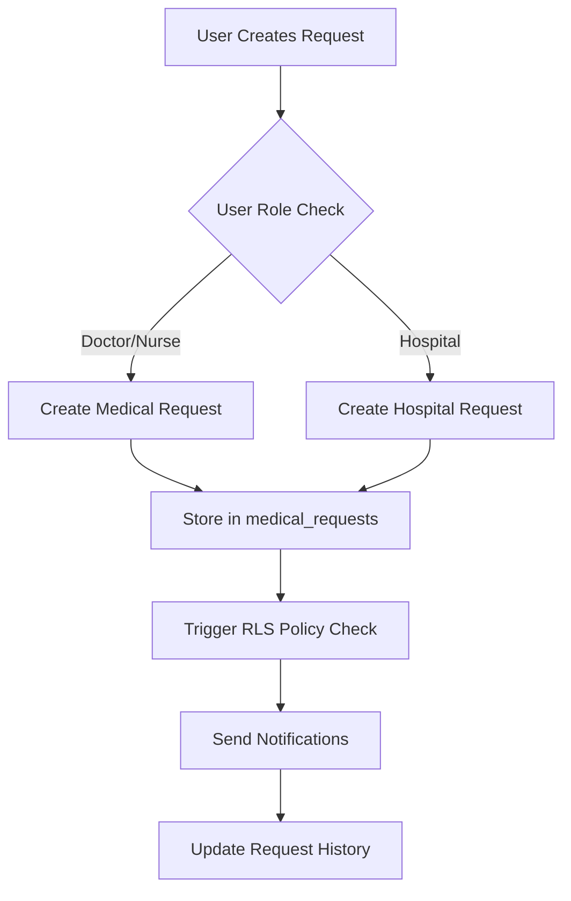
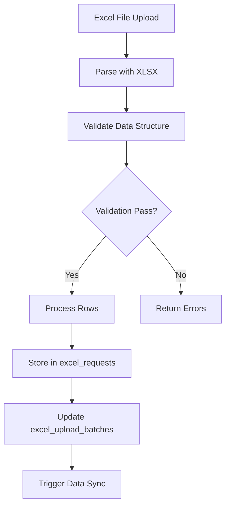
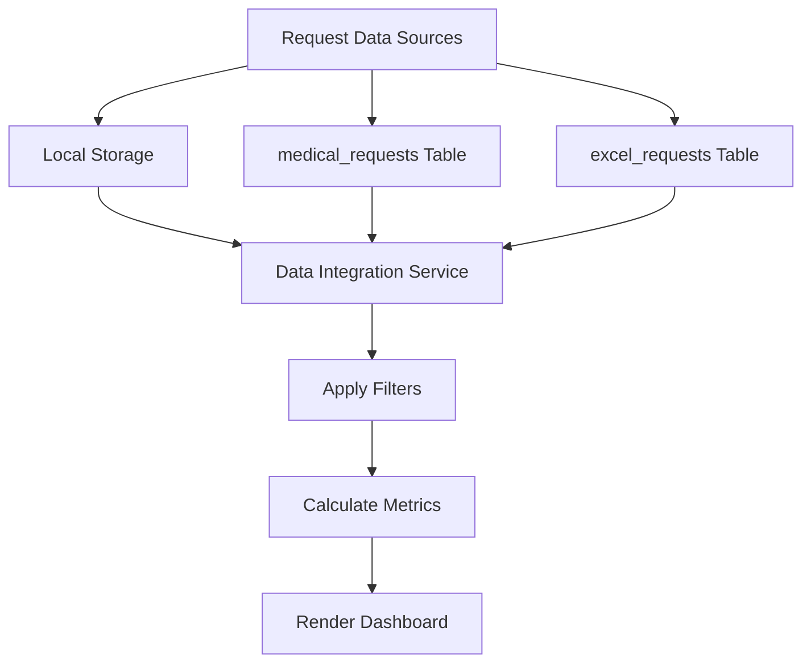

# Medical Request Management System - Complete Architecture Guide

## Table of Contents
1. [System Overview](#system-overview)
2. [User Roles & Permissions](#user-roles--permissions)
3. [Data Flow Architecture](#data-flow-architecture)
4. [Database Schema](#database-schema)
5. [Frontend Architecture](#frontend-architecture)
6. [Backend Integration](#backend-integration)
7. [Data Analysis Logic](#data-analysis-logic)
8. [Common Issues & Debugging](#common-issues--debugging)
9. [Performance Optimization](#performance-optimization)
10. [Security Implementation](#security-implementation)

## System Overview

### Core Functionality
This is a multi-tenant medical request management system that handles:
- **Medical Request Processing**: Patient referrals, approvals, scheduling
- **Excel Data Import**: Bulk data processing from spreadsheets
- **Analytics Dashboard**: SIA performance metrics and reporting
- **User Management**: Role-based access control
- **Finance Tracking**: Payment processing and revenue analytics
- **Communication**: Internal messaging and notifications

### Technology Stack
- **Frontend**: React 18 + TypeScript + Vite
- **UI Framework**: Tailwind CSS + shadcn/ui components
- **Backend**: Supabase (PostgreSQL + Edge Functions)
- **Authentication**: Supabase Auth with RLS
- **State Management**: React hooks + local storage
- **Data Processing**: XLSX library for Excel handling

## User Roles & Permissions

### Role Hierarchy
```
Admin (Full Access)
├── Case Coordinator (Hospital Management)
├── Finance (Financial Data)
├── Doctor (Medical Requests)
├── Nurse (Request Assistance)
├── Hospital (Institution Data)
└── Customer Care (Support)
```

### Permission Matrix
| Feature | Admin | Case Coord | Finance | Doctor | Nurse | Hospital | Customer Care |
|---------|-------|------------|---------|--------|-------|----------|---------------|
| View All Requests | ✅ | 🏥 | 🏥 | 👤 | 👤 | 🏥 | 👤 |
| Create Requests | ✅ | ✅ | ❌ | ✅ | ✅ | ✅ | ❌ |
| Edit Requests | ✅ | ✅ | ❌ | 👤 | 👤 | 🏥 | 👤 |
| Financial Data | ✅ | ❌ | ✅ | ❌ | ❌ | ❌ | ❌ |
| User Management | ✅ | ❌ | ❌ | ❌ | ❌ | ❌ | ❌ |
| Analytics | ✅ | ✅ | ✅ | 📊 | 📊 | 📊 | 📊 |

**Legend**: ✅ Full Access, 🏥 Hospital-scoped, 👤 Own records only, 📊 Limited analytics, ❌ No access

## Data Flow Architecture

### 1. Request Creation Flow


### 2. Excel Upload Flow


### 3. SIA Analytics Flow


## Database Schema

### Core Tables

#### medical_requests
```sql
CREATE TABLE medical_requests (
    id UUID PRIMARY KEY DEFAULT gen_random_uuid(),
    patient_name TEXT NOT NULL,
    patient_email TEXT,
    patient_phone TEXT,
    patient_id TEXT,
    medical_condition TEXT NOT NULL,
    specialty TEXT NOT NULL,
    hospital_code TEXT NOT NULL,
    hospital_name TEXT,
    branch_code TEXT,
    status request_status DEFAULT 'pending',
    urgency TEXT DEFAULT 'normal',
    request_date DATE,
    paid_amount NUMERIC DEFAULT 0,
    loss_reason TEXT,
    notes TEXT,
    attachments JSONB DEFAULT '[]',
    created_by UUID NOT NULL,
    assigned_to UUID,
    created_at TIMESTAMPTZ DEFAULT NOW(),
    updated_at TIMESTAMPTZ DEFAULT NOW()
);
```

#### excel_requests
```sql
CREATE TABLE excel_requests (
    id BIGSERIAL PRIMARY KEY,
    upload_id UUID REFERENCES excel_uploads(id),
    row_no INTEGER NOT NULL,
    request_date DATE,
    branch_code TEXT,
    hospital_code TEXT,
    hospital_name TEXT,
    specialty TEXT,
    status TEXT,
    loss_reason TEXT,
    paid_amount NUMERIC DEFAULT 0,
    patient_name TEXT,
    patient_id TEXT,
    raw_data JSONB,
    created_at TIMESTAMPTZ DEFAULT NOW(),
    updated_at TIMESTAMPTZ DEFAULT NOW()
);
```

#### profiles
```sql
CREATE TABLE profiles (
    id UUID PRIMARY KEY REFERENCES auth.users(id),
    email TEXT NOT NULL,
    full_name TEXT,
    role user_role NOT NULL DEFAULT 'doctor',
    status user_status NOT NULL DEFAULT 'pending',
    hospital_code TEXT,
    specialty TEXT,
    phone TEXT,
    department TEXT,
    permissions JSONB DEFAULT '{}',
    preferences JSONB DEFAULT '{}',
    last_login TIMESTAMPTZ,
    approved_by UUID,
    approved_at TIMESTAMPTZ,
    created_at TIMESTAMPTZ DEFAULT NOW(),
    updated_at TIMESTAMPTZ DEFAULT NOW()
);
```

### Row Level Security (RLS) Policies

#### Medical Requests Security
```sql
-- View Policy
CREATE POLICY "Secure patient data access" ON medical_requests
FOR SELECT USING (
    can_access_patient_data(id, 'view') AND
    CASE get_current_user_role()
        WHEN 'admin' THEN true
        WHEN 'doctor' THEN (
            (created_by = auth.uid() OR assigned_to = auth.uid()) AND
            (EXISTS (SELECT 1 FROM profiles 
                    WHERE id = auth.uid() 
                    AND (specialty = medical_requests.specialty OR specialty IS NULL)))
        )
        WHEN 'nurse' THEN (
            EXISTS (SELECT 1 FROM profiles 
                   WHERE id = auth.uid() 
                   AND hospital_code = medical_requests.hospital_code)
        )
        -- ... other roles
        ELSE false
    END
);
```

## Frontend Architecture

### Component Structure
```
src/
├── components/
│   ├── ui/                    # Base UI components (shadcn)
│   ├── admin/                 # Admin-specific components
│   ├── auth/                  # Authentication components
│   ├── finance/               # Finance dashboard components
│   ├── hospital/              # Hospital management components
│   ├── nurse/                 # Nurse workflow components
│   ├── doctor/                # Doctor interface components
│   ├── messaging/             # Communication system
│   └── settings/              # System configuration
├── hooks/                     # Custom React hooks
├── services/                  # Business logic services
├── pages/                     # Route components
├── types/                     # TypeScript definitions
└── utils/                     # Utility functions
```

### Key Services

#### Data Integration Service
```typescript
class DataIntegrationService {
    // Unifies data from multiple sources
    getAllUnifiedRequests(): Promise<UnifiedRequest[]>
    
    // Processes Excel uploads
    processExcelData(excelRows: any[]): Promise<ProcessResult>
    
    // Syncs local storage with Supabase
    syncLocalStorageToSupabase(): Promise<void>
    
    // Analytics data aggregation
    getAnalyticsData(): any[]
}
```

#### User Data Service
```typescript
class UserDataService {
    // Role-based data filtering
    getRequestsByRole(role: string, userInfo?: any): UnifiedRequest[]
    
    // Permission checking
    hasPermission(action: string, resource: string): boolean
    
    // Data access validation
    canAccessPatientData(requestId: string): boolean
}
```

### State Management Pattern

#### Local Storage Integration
```typescript
// Data persistence strategy
const STORAGE_KEYS = {
    MEDICAL_REQUESTS: 'medical_requests',
    EXCEL_REQUESTS: 'excel_requests',
    USER_PREFERENCES: 'userPreferences',
    ANALYTICS_CACHE: 'analyticsCache'
};

// Automatic sync between local storage and Supabase
useEffect(() => {
    const syncData = async () => {
        await dataIntegrationService.syncLocalStorageToSupabase();
    };
    
    // Sync on data changes
    window.addEventListener('storage', syncData);
    window.addEventListener('requestsUpdated', syncData);
    
    return () => {
        window.removeEventListener('storage', syncData);
        window.removeEventListener('requestsUpdated', syncData);
    };
}, []);
```

## Backend Integration

### Supabase Edge Functions

#### Email Notification Service
```typescript
// supabase/functions/send-notification-email/index.ts
import { createClient } from '@supabase/supabase-js';

const corsHeaders = {
    'Access-Control-Allow-Origin': '*',
    'Access-Control-Allow-Headers': 'authorization, x-client-info, apikey, content-type',
};

export default async function handler(req: Request) {
    if (req.method === 'OPTIONS') {
        return new Response(null, { headers: corsHeaders });
    }

    try {
        const { to, subject, html } = await req.json();
        
        // Send email using configured SMTP
        const emailResult = await sendEmail({
            to,
            subject,
            html
        });
        
        return new Response(
            JSON.stringify({ success: true, messageId: emailResult.messageId }),
            { headers: { ...corsHeaders, 'Content-Type': 'application/json' } }
        );
    } catch (error) {
        console.error('Email send error:', error);
        return new Response(
            JSON.stringify({ error: error.message }),
            { status: 500, headers: { ...corsHeaders, 'Content-Type': 'application/json' } }
        );
    }
}
```

### Database Functions

#### Excel Data Processing
```sql
CREATE OR REPLACE FUNCTION import_excel_rows(p_source_file text, p_rows jsonb)
RETURNS integer
LANGUAGE plpgsql
AS $$
DECLARE 
    v_upload uuid; 
    v_count int;
BEGIN
    -- Create upload record
    INSERT INTO excel_uploads(source_file) 
    VALUES (p_source_file) 
    RETURNING id INTO v_upload;

    -- Store raw data
    INSERT INTO excel_rows_raw(upload_id, row_no, "Date", "Branch", "Hospital Code", ...)
    SELECT v_upload, (row->>'__row')::int, row->>'Date', row->>'Branch', ...
    FROM jsonb_to_recordset(p_rows) as row;

    -- Process and normalize data
    INSERT INTO excel_requests(upload_id, row_no, request_date, branch_code, ...)
    SELECT
        v_upload,
        r.row_no,
        CASE 
            WHEN r."Date" ~ '^\d{4}-\d{2}-\d{2}$' THEN r."Date"::date
            WHEN r."Date" ~ '^\d{2}/\d{2}/\d{4}$' THEN to_date(r."Date",'DD/MM/YYYY')
            ELSE NULL
        END as request_date,
        norm_upper(r."Branch") as branch_code,
        -- ... other normalizations
    FROM excel_rows_raw r
    WHERE r.upload_id = v_upload;

    GET DIAGNOSTICS v_count = ROW_COUNT;
    RETURN v_count;
END $$;
```

## Data Analysis Logic

### SIA Metrics Calculation

#### Conversion Rate Logic
```typescript
const calculateConversionRate = (data: any[], selectedMonth: number, selectedYear: number) => {
    // Filter to referred cases only (exclude direct admissions)
    const referredCases = data.filter(req => {
        const branchValue = getBranchValue(req);
        return branchValue.includes('mcj') || branchValue.includes('mc ');
    });

    // Count by status
    const statusCounts = {
        completed: referredCases.filter(req => isStatusMatch(req, ['done', 'completed'])).length,
        scheduled: referredCases.filter(req => isStatusMatch(req, ['scheduled', 'booked'])).length,
        plannedNVD: referredCases.filter(req => isStatusMatch(req, ['planned', 'nvd'])).length
    };

    // Calculate conversion
    const totalConverted = statusCounts.completed + statusCounts.scheduled + statusCounts.plannedNVD;
    const totalReferred = referredCases.length;
    
    return {
        rate: totalReferred > 0 ? (totalConverted / totalReferred) * 100 : 0,
        breakdown: statusCounts,
        totals: { converted: totalConverted, referred: totalReferred }
    };
};
```

#### Branch Distribution Logic
```typescript
const calculateBranchMetrics = (data: any[]) => {
    const mcj1Cases = data.filter(req => {
        const branchValue = getBranchValue(req).toLowerCase();
        return branchValue.includes('mcj1') || branchValue.includes('muhammadiyah');
    });

    const mcj2Cases = data.filter(req => {
        const branchValue = getBranchValue(req).toLowerCase();
        return branchValue.includes('mcj2') || branchValue.includes('safa');
    });

    return {
        mcj1: { count: mcj1Cases.length, percentage: (mcj1Cases.length / data.length) * 100 },
        mcj2: { count: mcj2Cases.length, percentage: (mcj2Cases.length / data.length) * 100 },
        total: data.length
    };
};
```

### Analytics Data Sources

#### Unified Data Aggregation
```typescript
const aggregateAnalyticsData = () => {
    // Source 1: Medical requests from Supabase
    const medicalRequests = await supabase
        .from('medical_requests')
        .select('*')
        .gte('request_date', startDate)
        .lte('request_date', endDate);

    // Source 2: Excel imported data
    const excelRequests = await supabase
        .from('excel_requests')
        .select('*')
        .gte('request_date', startDate)
        .lte('request_date', endDate);

    // Source 3: Local storage data (for offline capability)
    const localData = JSON.parse(localStorage.getItem('medical_requests') || '[]');

    // Merge and deduplicate
    const unifiedData = mergeDataSources([
        medicalRequests.data || [],
        excelRequests.data || [],
        localData
    ]);

    return unifiedData;
};
```

## Common Issues & Debugging

### 1. RLS Policy Violations

**Symptom**: "new row violates row-level security policy"
```typescript
// ❌ Problem: Missing user authentication
const { data, error } = await supabase
    .from('medical_requests')
    .insert({ patient_name: 'John Doe' }); // Missing created_by

// ✅ Solution: Include user ID
const { data, error } = await supabase
    .from('medical_requests')
    .insert({ 
        patient_name: 'John Doe',
        created_by: user.id // Required for RLS
    });
```

### 2. Excel Upload Failures

**Common Issues**:
- Invalid date formats
- Missing required columns
- Character encoding problems

```typescript
// Debug Excel processing
const processExcelFile = async (file: File) => {
    console.log('Processing file:', file.name, 'Size:', file.size);
    
    try {
        const data = await file.arrayBuffer();
        const workbook = XLSX.read(data);
        
        console.log('Sheet names:', workbook.SheetNames);
        
        const worksheet = workbook.Sheets[workbook.SheetNames[0]];
        const jsonData = XLSX.utils.sheet_to_json(worksheet);
        
        console.log('Parsed rows:', jsonData.length);
        console.log('Sample data:', jsonData.slice(0, 3));
        
        // Validate required columns
        const requiredColumns = ['Date', 'Branch', 'Status'];
        const missingColumns = requiredColumns.filter(col => 
            !jsonData[0]?.hasOwnProperty(col)
        );
        
        if (missingColumns.length > 0) {
            throw new Error(`Missing columns: ${missingColumns.join(', ')}`);
        }
        
        return jsonData;
    } catch (error) {
        console.error('Excel processing error:', error);
        throw error;
    }
};
```

### 3. Performance Issues

**Symptoms**: Slow dashboard loading, high memory usage

```typescript
// ❌ Problem: Loading all data at once
const loadAllData = async () => {
    const allRequests = await supabase.from('medical_requests').select('*');
    return allRequests.data; // Could be thousands of records
};

// ✅ Solution: Implement pagination and filtering
const loadDataPaginated = async (page: number, filters: any) => {
    const pageSize = 100;
    const query = supabase
        .from('medical_requests')
        .select('*', { count: 'exact' })
        .range(page * pageSize, (page + 1) * pageSize - 1);
    
    // Apply filters
    if (filters.status) query.eq('status', filters.status);
    if (filters.dateFrom) query.gte('request_date', filters.dateFrom);
    if (filters.dateTo) query.lte('request_date', filters.dateTo);
    
    return query;
};
```

### 4. Data Synchronization Issues

**Problem**: Local storage and Supabase out of sync

```typescript
// Sync detection and resolution
const detectSyncIssues = async () => {
    const localData = JSON.parse(localStorage.getItem('medical_requests') || '[]');
    const { data: remoteData } = await supabase
        .from('medical_requests')
        .select('id, updated_at');
    
    const conflicts = localData.filter(local => {
        const remote = remoteData?.find(r => r.id === local.id);
        return remote && new Date(remote.updated_at) > new Date(local.updated_at);
    });
    
    if (conflicts.length > 0) {
        console.warn('Sync conflicts detected:', conflicts.length);
        // Trigger manual sync resolution
        await resolveSyncConflicts(conflicts);
    }
};
```

## Performance Optimization

### 1. Data Loading Strategies

#### Lazy Loading Implementation
```typescript
const useLazyDataLoading = (dependencies: any[]) => {
    const [data, setData] = useState<any[]>([]);
    const [loading, setLoading] = useState(false);
    const [hasMore, setHasMore] = useState(true);
    
    const loadMore = useCallback(async () => {
        if (loading || !hasMore) return;
        
        setLoading(true);
        try {
            const newData = await loadDataBatch(data.length);
            setData(prev => [...prev, ...newData]);
            setHasMore(newData.length === BATCH_SIZE);
        } finally {
            setLoading(false);
        }
    }, [data.length, loading, hasMore]);
    
    return { data, loading, hasMore, loadMore };
};
```

#### Caching Strategy
```typescript
const cacheManager = {
    set: (key: string, data: any, ttl: number = 300000) => { // 5 minutes default
        const item = {
            data,
            timestamp: Date.now(),
            ttl
        };
        localStorage.setItem(`cache_${key}`, JSON.stringify(item));
    },
    
    get: (key: string) => {
        const item = localStorage.getItem(`cache_${key}`);
        if (!item) return null;
        
        const parsed = JSON.parse(item);
        if (Date.now() - parsed.timestamp > parsed.ttl) {
            localStorage.removeItem(`cache_${key}`);
            return null;
        }
        
        return parsed.data;
    }
};
```

### 2. Database Query Optimization

#### Efficient Filtering
```sql
-- ❌ Inefficient: Full table scan
SELECT * FROM medical_requests 
WHERE EXTRACT(MONTH FROM request_date) = 7 
AND EXTRACT(YEAR FROM request_date) = 2025;

-- ✅ Efficient: Index-friendly range query
SELECT * FROM medical_requests 
WHERE request_date >= '2025-07-01' 
AND request_date <= '2025-07-31';

-- Create supporting index
CREATE INDEX idx_medical_requests_date_status 
ON medical_requests(request_date, status) 
WHERE request_date IS NOT NULL;
```

## Security Implementation

### 1. Data Access Control

#### Function-Based Security
```sql
-- Security definer function prevents RLS recursion
CREATE OR REPLACE FUNCTION get_current_user_role()
RETURNS user_role
LANGUAGE sql
STABLE SECURITY DEFINER
SET search_path = ''
AS $$
    SELECT role FROM public.profiles WHERE id = auth.uid();
$$;

-- Role-based data masking
CREATE OR REPLACE FUNCTION mask_patient_data(
    patient_name text, 
    patient_phone text, 
    patient_email text, 
    user_role user_role
)
RETURNS jsonb
LANGUAGE plpgsql
SECURITY DEFINER
AS $$
BEGIN
    RETURN jsonb_build_object(
        'patient_name', CASE 
            WHEN user_role IN ('admin', 'doctor', 'nurse', 'case-coordinator') 
            THEN patient_name
            WHEN user_role = 'finance' 
            THEN LEFT(patient_name, 1) || '***'
            ELSE 'RESTRICTED'
        END,
        'patient_phone', CASE 
            WHEN user_role IN ('admin', 'doctor', 'nurse', 'case-coordinator') 
            THEN patient_phone
            WHEN user_role = 'finance' 
            THEN 'XXX-XXX-' || RIGHT(patient_phone, 4)
            ELSE 'RESTRICTED'
        END,
        'patient_email', CASE 
            WHEN user_role IN ('admin', 'doctor', 'nurse', 'case-coordinator') 
            THEN patient_email
            WHEN user_role = 'finance' 
            THEN REGEXP_REPLACE(patient_email, '^([^@]{1,2})[^@]*(@.*)$', '\1***\2')
            ELSE 'RESTRICTED'
        END
    );
END;
$$;
```

### 2. Audit Logging

#### Comprehensive Activity Tracking
```sql
CREATE OR REPLACE FUNCTION audit_patient_data_access()
RETURNS trigger
LANGUAGE plpgsql
SECURITY DEFINER
AS $$
BEGIN
    INSERT INTO audit_log (
        table_name,
        record_id,
        action,
        user_id,
        user_email,
        timestamp,
        accessed_columns
    ) VALUES (
        TG_TABLE_NAME,
        CASE TG_OP
            WHEN 'INSERT' THEN NEW.id
            WHEN 'UPDATE' THEN NEW.id
            WHEN 'DELETE' THEN OLD.id
            ELSE NEW.id
        END,
        TG_OP || '_PATIENT_DATA',
        auth.uid(),
        (SELECT email FROM auth.users WHERE id = auth.uid()),
        NOW(),
        CASE TG_OP
            WHEN 'SELECT' THEN ARRAY['patient_name', 'patient_email', 'patient_phone']
            ELSE NULL
        END
    );
    
    RETURN CASE TG_OP
        WHEN 'DELETE' THEN OLD
        ELSE NEW
    END;
END;
$$;
```

## Conclusion

This architecture documentation provides a comprehensive overview of the medical request management system. Key points for maintenance and debugging:

1. **Always check RLS policies first** when users report data access issues
2. **Monitor audit logs** for security and performance insights
3. **Use the caching layer** appropriately to improve performance
4. **Follow the data flow diagrams** when troubleshooting integration issues
5. **Implement proper error boundaries** in React components
6. **Regular database maintenance** including index optimization and cleanup

For additional support, refer to the troubleshooting documentation and consider implementing monitoring dashboards for proactive issue detection.